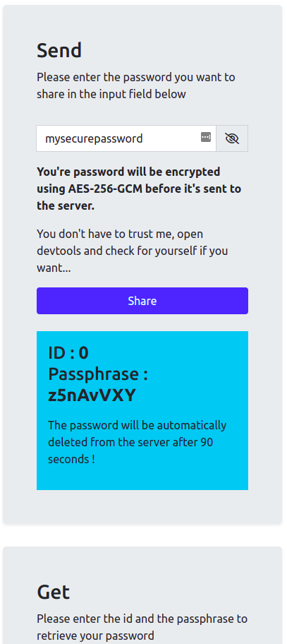

<div id="top"></div>

[![Contributors][contributors-shield]][contributors-url]
[![Forks][forks-shield]][forks-url]
[![Stargazers][stars-shield]][stars-url]
[![Issues][issues-shield]][issues-url]
[![MIT License][license-shield]][license-url]
[![LinkedIn][linkedin-shield]][linkedin-url]


<!-- PROJECT LOGO -->
<br />
<div align="center">
  <a href="https://github.com/Mekacher-Anis/passhare">
    
  </a>

<h3 align="center">Passhare</h3>

  <p align="center">
    Secure password sharing using a passphrase (without a link)
    <br />
    <br />
    <a href="https://anpass.de">View Demo</a>
    ·
    <a href="https://github.com/Mekacher-Anis/passhare/issues">Report Bug</a>
    ·
    <a href="https://github.com/Mekacher-Anis/passhare/issues">Request Feature</a>
  </p>
</div>


<!-- TABLE OF CONTENTS -->
<details>
  <summary>Table of Contents</summary>
  <ol>
    <li>
      <a href="#about-the-project">About The Project</a>
      <ul>
        <li><a href="#built-with">Built With</a></li>
      </ul>
    </li>
    <li>
      <a href="#getting-started">Getting Started</a>
      <ul>
        <li><a href="#prerequisites">Prerequisites</a></li>
        <li><a href="#installation">Installation</a></li>
      </ul>
    </li>
    <li><a href="#usage">Usage</a></li>
    <li><a href="#roadmap">Roadmap</a></li>
    <li><a href="#contributing">Contributing</a></li>
    <li><a href="#license">License</a></li>
    <li><a href="#contact">Contact</a></li>
    <li><a href="#acknowledgments">Acknowledgments</a></li>
  </ol>
</details>


<!-- ABOUT THE PROJECT -->
## About The Project

**Problem (small background):** \
I use a password manager and my passwords are automatically generated and are therefor pretty long and complex. \
Everytime I have to login to an account on a device on which I don't have my password manager setup, I need to go to the password manager on another logged device and hit "reveal" and then copy the 30 charachter long password with all the weird symbols per hand. \
All the other available solutions do the same thing: generate a very long ULR which you need to send to the other device. This acutally makes the problem worse as now you have to enter this really long and weird URL.\
**The Solution:**\
This Webapp encryptes the password on the device before sending it to the server using an 8-charachter-long "passphrase" (in total 218340105584896 possible combinations) which gets displayed to the user. On the other device the user simply needs to enter this short passphrase to decrypt the password.
<a target="_blank" href="https://anpass.de"><h2>Checkout the demo</h2></a>





## Built With


* [Node.js](https://nodejs.org/)
* [Express](https://expressjs.com/)
* [WebCrypto](https://developer.mozilla.org/en-US/docs/Web/API/Web_Crypto_API)
* [Bootstrap](https://getbootstrap.com)


<!-- GETTING STARTED -->
## Getting Started

**This Webapp only works on Secure website (TLS) as that's one of the requirements for using Webcrypto API.** \
No worries, Webcrypto works on `localhost` too (so please avoid using `0.0.0.0` or similar IPs)

### Prerequisites

This project requires nodejs to be installed.
* nodejs (https://nodejs.org/en/download/)

### Installation

1. Clone the repo
   ```sh
   git clone https://github.com/Mekacher-Anis/passhare.git
   ```
2. Install NPM packages
   ```sh
   npm run install:deps
   ```
3. Serve the app
   ```sh
   npm run serve
   ```


<!-- USAGE EXAMPLES -->
## Usage

- Device 1
  1. Enter Password
  2. Click send
- Device 2
  1. Enter the ID (usually `0` and it's already filled-out)
  2. Click Get
  3. Click Copy to copy your passwod.


<!-- ROADMAP -->
## Roadmap

- [ ] Add a docker container.

See the [open issues](https://github.com/Mekacher-Anis/passhare/issues) for a full list of proposed features (and known issues).


<!-- CONTRIBUTING -->
## Contributing

Contributions are what make the open source community such an amazing place to learn, inspire, and create. Any contributions you make are **greatly appreciated**.

If you have a suggestion that would make this better, please fork the repo and create a pull request. You can also simply open an issue with the tag "enhancement".
Don't forget to give the project a star! Thanks again!

1. Fork the Project
2. Create your Feature Branch (`git checkout -b feature/AmazingFeature`)
3. Commit your Changes (`git commit -m 'Add some AmazingFeature'`)
4. Push to the Branch (`git push origin feature/AmazingFeature`)
5. Open a Pull Request

<!-- ACKNOWLEDGMENTS -->
## Acknowledgments

* [Password icons created by Smashicons - Flaticon](https://www.flaticon.com/free-icons/password)


<!-- LICENSE -->
## License

Distributed under the MIT License. See `LICENSE` for more information.


<!-- CONTACT -->
## Contact

Project Link: [https://github.com/Mekacher-Anis/passhare](https://github.com/Mekacher-Anis/passhare)

<p align="right">(<a href="#top">back to top</a>)</p>


<!-- MARKDOWN LINKS & IMAGES -->
<!-- https://www.markdownguide.org/basic-syntax/#reference-style-links -->
[contributors-shield]: https://img.shields.io/github/contributors/Mekacher-Anis/passhare.svg?style=for-the-badge
[contributors-url]: https://github.com/Mekacher-Anis/passhare/graphs/contributors
[forks-shield]: https://img.shields.io/github/forks/Mekacher-Anis/passhare.svg?style=for-the-badge
[forks-url]: https://github.com/Mekacher-Anis/passhare/network/members
[stars-shield]: https://img.shields.io/github/stars/Mekacher-Anis/passhare.svg?style=for-the-badge
[stars-url]: https://github.com/Mekacher-Anis/passhare/stargazers
[issues-shield]: https://img.shields.io/github/issues/Mekacher-Anis/passhare.svg?style=for-the-badge
[issues-url]: https://github.com/Mekacher-Anis/passhare/issues
[license-shield]: https://img.shields.io/github/license/Mekacher-Anis/passhare.svg?style=for-the-badge
[license-url]: https://github.com/Mekacher-Anis/passhare/blob/master/LICENSE.txt
[linkedin-shield]: https://img.shields.io/badge/-LinkedIn-black.svg?style=for-the-badge&logo=linkedin&colorB=555
[linkedin-url]: https://www.linkedin.com/in/anis-mekacher-442091126/
[product-screenshot]: images/screenshot.png